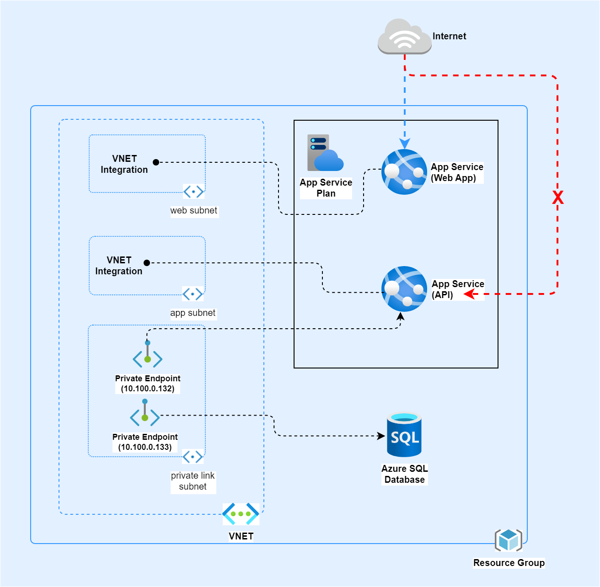

# Introduction 
Challenge 1 - Create 3-tier Architecture resources on cloud environment

This contains Terraform IaaC Scripts for 3-tier Architecture Infrastructure Automation in Azure.

# Architecture Diagram
Following diagram contains infrastructure components which are created and connectivity between them.

# Pre-requisites-
Local Environment Setup-
In Command Prompt, Create Environment Variable
For Windows Cmd ==>
set ARM_CLIENT_ID=<<CLIENT_ID>>
set ARM_CLIENT_SECRET=<<SECRET>>
set ARM_SUBSCRIPTION_ID=<<SUBSCRIPTION_ID>>
set ARM_TENANT_ID=<<TENANT_ID>>

# Terraform Commands-

1. Initialize Terraform
terraform --version

terraform init

2. Validate Terraform Structure
terraform validate

3. Create Terraform Plan
terraform plan -var-file="env-dev.tfvars"

4. Apply Terraform Plan
terraform apply -var-file="env-dev.tfvars" -input=false -auto-approve

5. Destroy the infrastructure if needed
terraform destroy -var-file="env-dev.tfvars" -input=false -auto-approve

# Contributor
- Santosh Raundhal