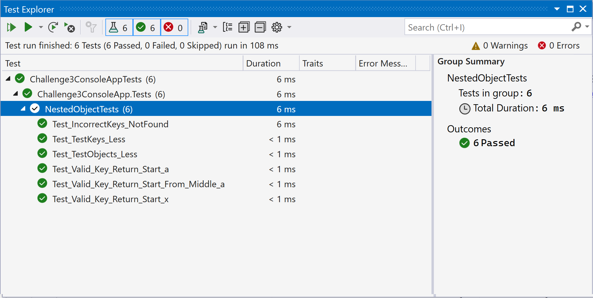

# Introduction 
Challenge 3 - We have a nested object. We would like a function where you pass in the object and a key
and get back the value.

Example inputs:  
object = {"a":{"b":{"c":"d"}}}  
key = a/b/c  
value = d  

object = {"x":{"y":{"z":"a"}}}  
key = x/y/z  
value = a

# Implementation Details
Implementation has been done C# .NET. NestedObject.cs file contains all the implementation.
Test Cases has been written and present in NestedObjectTests.cs file in Test Project using MSTest.
All the Test Cases are in Pass stage.

# Test Cases
Following image shows Test Cases has been passed.

# Contributor
- Santosh Raundhal
